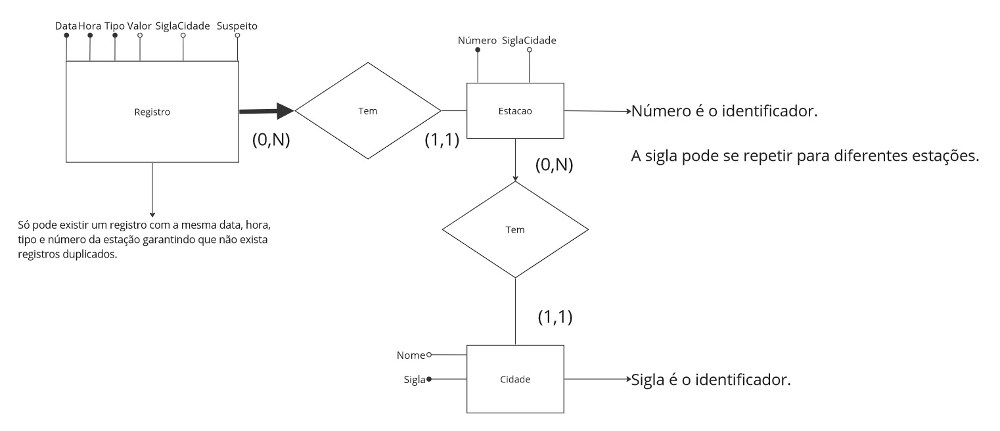
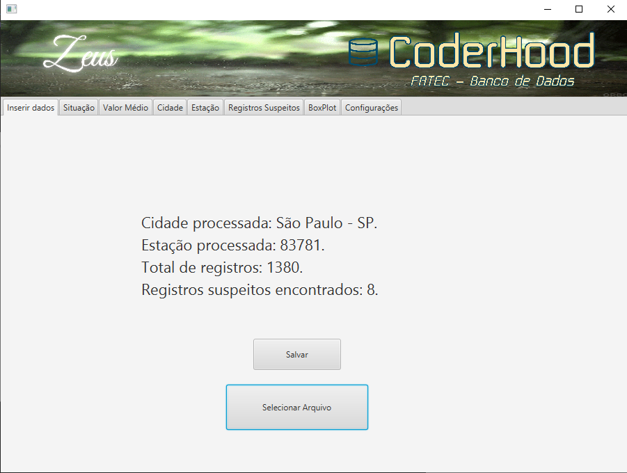
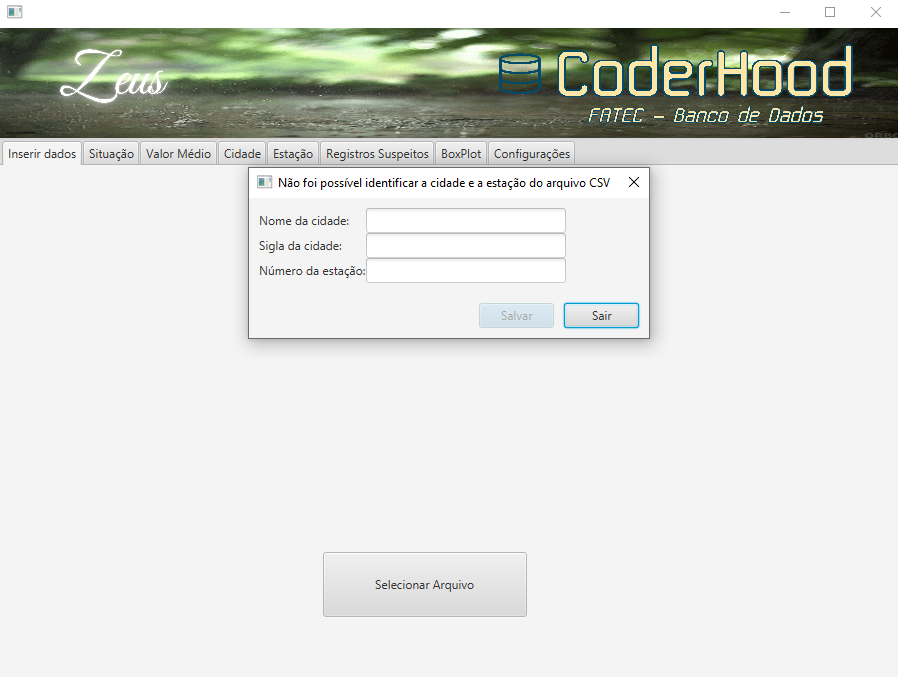
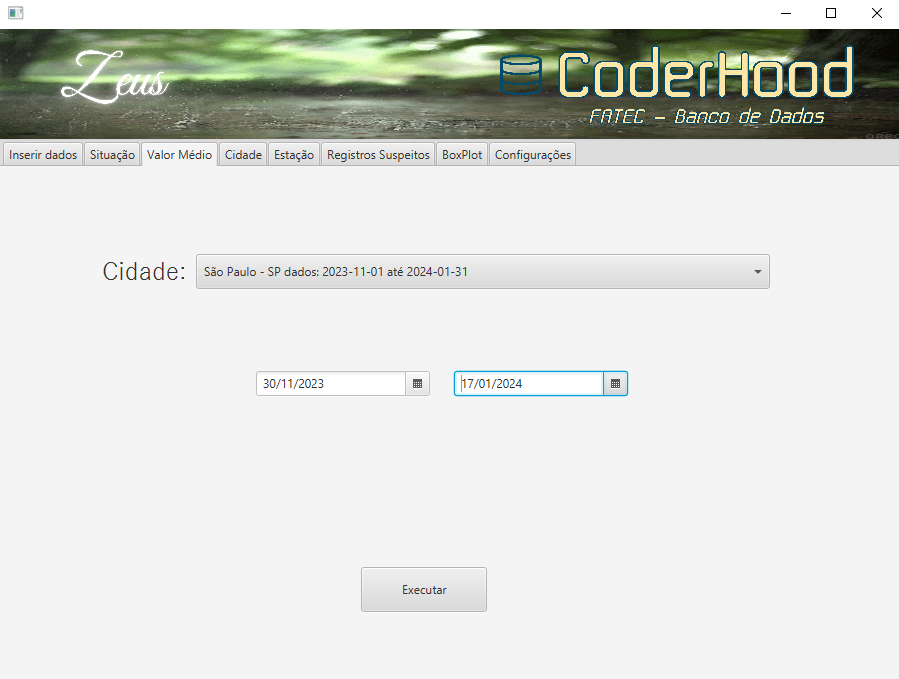
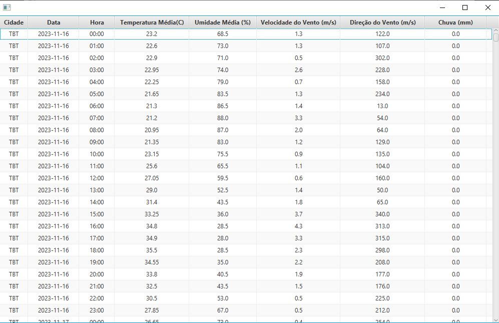
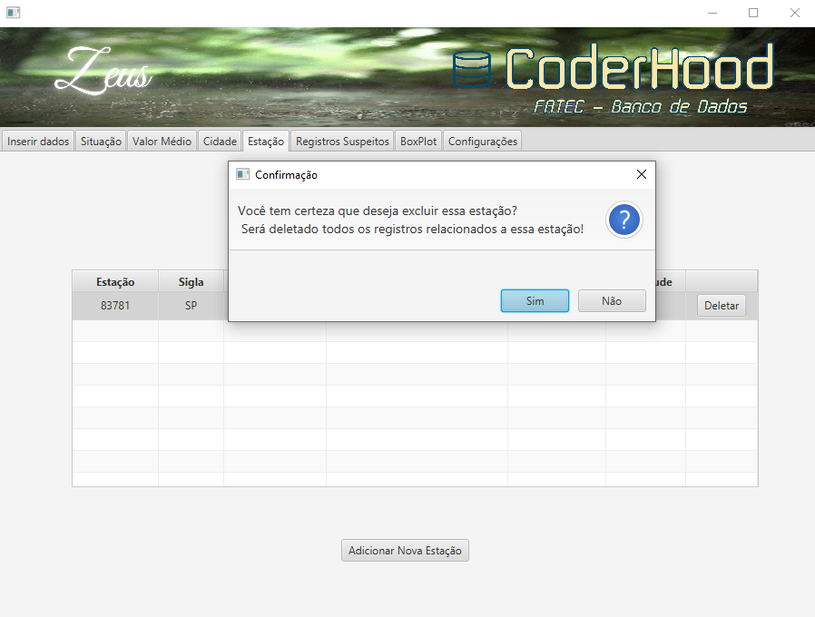
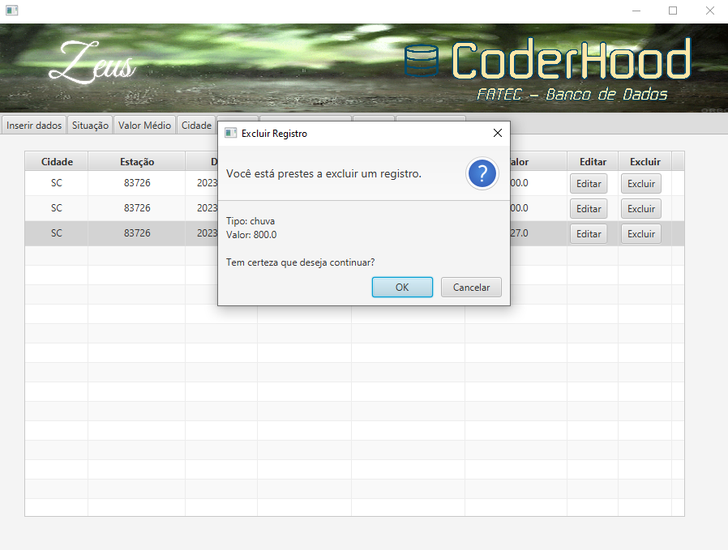
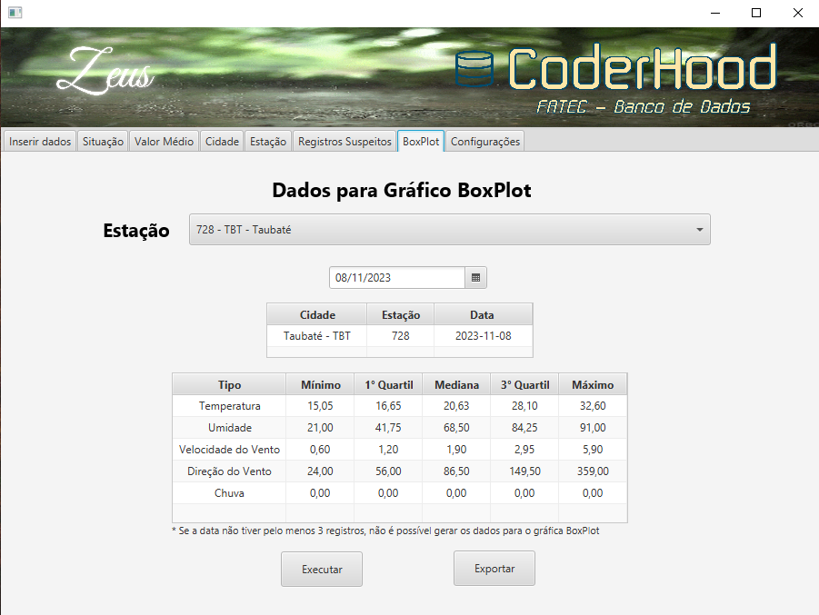
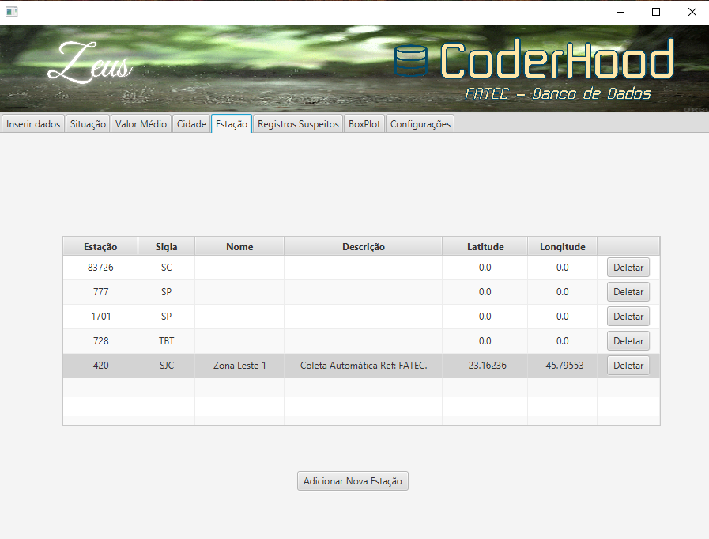

# Documentação do Produto

## Backlog do Produto
- [Sprint 1:](#sprint-1)
  - [Carregar e validar CSV](#carregar-e-validar-csv)
  - [Relatório de valor médio](#relatório-de-valor-médio) 

- [Sprint 2:](#sprint-2)
  - [Relatório de valor médio](#relatório-de-valor-médio)
  - [Faixa de valores suspeitos configurável](#faixa-de-valores-suspeitos-configurável)
  - [Gerenciamento de cidades](#gerenciamento-de-cidades)
  - [Gerenciamento de estações](#gerenciamento-de-estações)
  - [Tratamento de registros suspeitos](#tratamento-de-registros-suspeitos)  

- [Sprint 3:](#sprint-3) Todos os requisitos funcionais foram entregues ✅
  - [Relatório de Situação](#relatório-de-situação)
  - [Dados BoxPlot](#dados-boxplot)
  - [Gerenciamento de unidades de medida](#gerenciamento-de-unidades-de-medida)
  - [Adicionado mais informações às estações](#adicionado-mais-informações-às-estações)
  - [Retirado a obrigatoriedade do nome da cidade](#retirado-a-obrigatoriedade-do-nome-da-cidade)

- [Sprint 4:](#sprint-4)
  - [Otimização do banco](#otimização-do-banco)
  - [Otimização de código](#otimização-de-código)
  - [Testes Unitários](#testes-unitários)
  - Manual do usuário
  - Documentação 

## Entidade Relacionamento

## Sprint 1

### Carregar e validar CSV:

**História do usuário:**
Como meteorologista, eu quero inserir um CSV e adicionar os dados coletados de uma estação, afim de garantir que suas informações estejam corretas.

**Regras de negócio:**

1. **Inserção de CSV:**
   - Caso o nome do CSV selecionado esteja no padrão esperado e não exista o cadastro da cidade:
     - Será solicitado o nome da cidade para a sigla correspondente do nome do arquivo.
     - Será criado a estação se não existir.
     
   - A cidade já exista:
     - Será utilizada a cidade já cadastrada.

   - Caso o nome do CSV não esteja no padrão esperado:
     - Será solicitado o nome da cidade.
     - Será solicitada a sigla da cidade.
     - Será solicitado o número da estação.
   - A sigla da cidade já exista:
     - O nome registrado será utilizado.

2. **Tratamento de erros na inserção:**
   - Caso a estação já exista e esteja associada à outra cidade, Retornará um erro indicando que a estação está relacionada a uma cidade diferente.

**Interface do usuário:**

**Tela inicial:**

**Arquivo selecionado com sucesso:**

**Após selecionar para salvar na base de dados:**

##

**Tratamento de erros na interface:**

**A estação inserida está relacionada com uma cidade diferente:**

**A sigla ainda não está associada a uma cidade:**

**O nome do CSV não está no padrão esperado:**

### Relatório de valor médio:

**História do usuário:**
Como meteorologista, eu quero gerar um relatório de valores médios de uma cidade, a partir de uma data inicial e data final, com registros de hora em hora. Afim de prever as melhores condições para desenvolver as atividades do meu negócio.

**Regras de negócio:**

- Será solicitado uma cidade, uma data inicial e outra final.
- Será mostrado todos os registros desse periodo com periodicidade de uma hora.
- Dados suspeitos não apareceram.
     
**Interface do usuário:**

**Selecionar cidade e datas:**

**Tabela com registros:**

## Sprint 2

### Relatório de valor médio:

**História do usuário:**

Como pesquisador, eu quero relatórios de valor médio de cada váriavel climatica

**Regras de negócio:**
- Será selecionado uma cidade, data inicial e final, será retornado uma tabela com o valor médio para cada variavel com peridicidade de uma hora.
- Se houver registros para mesma data e hora mas com estações diferentes, deve ser feito uma média.

**Interface do usuário:**

##

### Faixa de valores suspeitos configurável:

**História do usuário:**

Como pesquisador, eu quero alterar os valores minimos e máximos de cada tipo climático, afim de poder personalizar os filtros da leitura do CSV.

**Regras de negócio:**
- Alterar os valores minimos e máximos fará efeito somente nas novas leituras, registros já processados não serão válidados.

**Interface do usuário:**

##

### Gerenciamento de Cidades:

**História do usuário:**

Como pesquisador, eu quero gerenciar cidades, podendo assim escalar e manejar as cidades cadastradas.

**Regras de negócio:**
- Criar uma nova cidade.
- Deletar uma cidade.
- Não será possível repetir a sigla de uma cidade que já exista ao criar.
- Ao deletar será deletado todos as estações e registros ligado a essas cidades.

**Interface do usuário:**

##

### Gerenciamento de Estações:

**História do usuário:**
Como pesquisador, eu quero gerenciar estações, podendo assim escalar e manejar estações cadastradas.

**Regras de negócio:**
- Criar uma nova estação.
- Deletar uma estação.
- Não será possível repetir um número de estação que já exista ao criar.
- Ao deletar será deletado todos os registros ligados a essa estação.

**Interface do usuário:**

 

 

##

### Tratamento de Registros Suspeitos:

**História do usuário:**
Como pesquisador, eu quero gerenciar registros que contêm valores suspeitos, afim de poder revisar os registros identificados como suspeitos ou deletá-los.

**Regras de negócio:**
 - Ao alterar o valor suspeito para um valor dentro do estipulado nas configurações, ele será salvo.
 - Ao alterar o valor suspeito para um valor fora do estipulado nas configurações, será retornado um erro.
 - Ao deletar o registro com valor suspeito, os demais registros relacionados serão deletados.

 **Interface do usuário:**

##

## Sprint 3

### Relatório de Situação:

**História do usuário:**
Como pesquisador, posso visualizar relatório de situação, afim de verificar as últimas medidas de cada cidade.

**Regras de negócio:**
- Ao selecionar a aba de *Situação* será visualizado as últimas medidas de cada cada.

 **Interface do usuário:**
 
 

##

 ### Dados BoxPlot:

**História do usuário:**
Como pesquisador, posso gerar dados necessários para a criação de um gráfico boxplot, para entender melhor as variações e tendências climáticas.

**Regras de negócio:**
- Deve ser selecionado uma estaçãoe uma estação.
- Será gerado para cada váriavel climatica("Temperatura Média", "Umidade Média", "Velocidade do Vento", "Direção do Vento", "Chuva"): 
  - Mínimo
  - Primeiro quartil
  - Mediana
  - Terceiro quartil
  - Máximo

- Será possível exportar em formato CSV.

 **Interface do usuário:**
 

 **CSV exportado:**

  ### Gerenciamento de unidades de medida:

**História do usuário:**
Como pesquisador, quero poder informar o nome das unidades e exibir suas formulas de conversão de unidade, afim de manter a congiuração clara a todos os usuários.

**Regras de negócio:**
- Deve ser possível informar para cada variavel climática:
  - Unidade de medida
  - Descrição da conversão
  - Formula de conversão

 **Interface do usuário:**

  ### Adicionado mais informações às estações:

  **História do usuário:**
Como pesquisador, quero poder adicionar dados adicionais aos extraidos do CSV, afim de identificar cada estação pela localização ou pelo nome.

**Regras de negócio:**
- Deve ser possível informar para cada variavel climática:
  - Unidade de medida
  - Descrição da conversão
  - Formula de conversão

 **Interface do usuário:**

  ### Retirado a obrigatoriedade do nome da cidade:

  **Regras de negócio:**
  - Somente a sigla é exigida ao se criar uma cidade.

  ### Sprint 4:

#### Otimização do banco:
Melhorar a eficiência do nosso banco de dados. Estaremos trabalhando na otimização de consultas, estruturação de dados e garantindo a integridade dos dados.

#### Otimização de código:
Revisão do código para identificar áreas que podem ser otimizadas. Isso inclui refatoração para melhor legibilidade, melhor desempenho e manutenibilidade.

#### Testes Unitários:
Para garantir a qualidade do código, estaremos escrevendo e executando testes unitários. Isso nos ajudará a identificar e corrigir bugs antes que eles cheguem ao ambiente de produção.
  